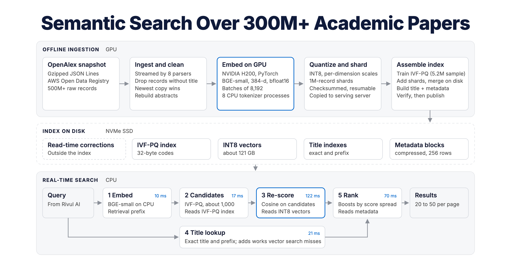

<p align="center">
  
</p>

<p align="center">
  <b>Semantic search over 300 million plus OpenAlex works, without a vector database.</b><br>
  Embedded once on a GPU. Indexed and served on a single CPU server.
</p>

<div align="center">

[](LICENSE)
[](pyproject.toml)
[](https://openalex.org)
[](https://arjunprabhulal.com/how-i-built-semantic-search-300m-academic-papers/)

</div>

Search by meaning, not just keywords. *"shrinking neural networks so they run on phones"*
returns ShuffleNet and papers on compressing CNNs for mobile devices, though none of them
say "shrinking" or "phones". Paste an exact title and you get that paper. It powers the
paper search in [Rivul AI](https://rivul.ai).

<p align="center">
  
</p>

## Highlights

<table>
<tr><td><b>One server, 300M+ records</b></td><td>A ~249 GB immutable index on local NVMe, served by 16 CPU cores and 61 GB of RAM. 240 ms median for a new query, 41 ms repeated.</td></tr>
<tr><td><b>Two compressed vector forms</b></td><td>32-byte PQ codes find ~1,000 candidates broadly; 384-byte INT8 vectors re-score only that shortlist accurately.</td></tr>
<tr><td><b>Exact titles still work</b></td><td>Exact and prefix title indexes feed the same candidate pool, because pure vector search misses pasted titles at this scale.</td></tr>
<tr><td><b>Filters that stay fast</b></td><td>The filter path is chosen from measured costs: exact scoring for selective filters, scaled candidate requests for wider ones.</td></tr>
<tr><td><b>Restartable GPU ingestion</b></td><td>1M-record shards committed by a marker written last, pinned settings and INT8 clip checks. A multi-day run can stop and resume safely.</td></tr>
<tr><td><b>Fix data without rebuilding</b></td><td>Hand-verified overrides and supplement records correct upstream errors at read time; the index never changes.</td></tr>
</table>

## Beyond OpenAlex

OpenAlex is the showcase, not a limit. The same design fits any large text corpus that is
read far more often than it changes: product catalogues, documentation, patents, legal
archives, support tickets, or the retrieval layer behind a RAG application.

**No vector database.** The index is a directory of plain files: IVF-PQ codes, INT8 vectors
and compressed metadata blocks. One process memory-maps it and serves queries. Backups are
file copies, and a new version is a new directory.

**Bring your own documents.** Only ingestion is OpenAlex-specific. Put one JSON document
per line and build with the included example:

```json
{"id": "kb-102", "title": "Resetting a forgotten account password", "body": "Open the sign-in page...", "year": 2024, "popularity": 10, "category": "Support"}
```

```bash
python examples/custom_corpus.py docs.jsonl indexes/my-docs
openalex-semantic-search serve --generation indexes/my-docs --port 8100
```

Only `id` and `title` are required. `year`, `popularity` and `category` power the year
filters, the popularity boost and sort, and the topic filter. Embedding, INT8
quantization, IVF-PQ, title matching, ranking and the HTTP API are the same code paths
used for OpenAlex. On a 2,000-document test corpus, *"I can't log in to my account"*
returned *Resetting a forgotten account password* first. Corpora under ~10K documents
print a FAISS warning about training points; search still works. Direct id lookup
(`work_id`) expects OpenAlex-style ids.

## In production

This engine is the paper search behind [Rivul AI](https://rivul.ai). The web app's search
page and its MCP and REST API call it from the server over HTTPS with a private key; the
browser never sees the index or the key. Results are cached briefly per query, and every
retrieval runs on one CPU server reading the files described above. No vector database is
involved at any step.

## Requirements

| Goal | Hardware | Time |
|---|---|---|
| **Try it** (10K records) | Any laptop: 4 GB RAM, 2 GB disk | ~2 minutes on a laptop CPU |
| **Evaluate** (1M records) | Laptop or server CPU; a GPU makes embedding much faster | Hours on CPU, minutes on a GPU |
| **Full corpus** (300M+) | Embedding: one data-centre GPU (NVIDIA H200 used here). Serving: 16 CPU cores, 64 GB RAM, ~1 TB local NVMe | About one day of GPU time, then CPU assembly |

Python 3.11 or newer on Linux or macOS. The public OpenAlex snapshot is read directly from
S3; no AWS account is needed. First use downloads the
[BGE-small](https://huggingface.co/BAAI/bge-small-en-v1.5) model (~130 MB).

> [!NOTE]
> **macOS:** run these once per terminal before building or running tests.
> ```bash
> export OMP_NUM_THREADS=1   # PyTorch and FAISS each load their own OpenMP runtime
> ulimit -n 2048             # the default of 256 open files is too low
> ```
> **Windows:** use WSL2.

## Quick start

```bash
git clone https://github.com/arjunprabhulal/openalex-semantic-search
cd openalex-semantic-search
python -m venv .venv && source .venv/bin/activate
pip install -e '.[runtime]'

# 1. Build a 10,000-record index from the public snapshot
openalex-semantic-search build --stage 10k --output indexes/10k

# 2. Serve it
export OPENALEX_SEARCH_API_KEYS="$(python -c 'import secrets; print(secrets.token_urlsafe(32))')"
openalex-semantic-search serve --generation indexes/10k --port 8100

```

In another terminal, with the same key exported:

```bash
curl -s http://127.0.0.1:8100/search \
  -H "X-API-Key: $OPENALEX_SEARCH_API_KEYS" -H 'Content-Type: application/json' \
  -d '{"query": "attention is all you need", "limit": 5}'

# or
python examples/search.py "attention is all you need"
```

A 10K index is a random sample of OpenAlex, so topical queries find only what happens to
be in it.

> [!TIP]
> Set `OPENALEX_SEARCH_UI=1` before `serve` for a small search page at `http://127.0.0.1:8100/`.

## Build the full index

Indexes grow through gated stages, each with its own quality checks:
`10k → 100k → 1m → 10m → 25m → 50m → full`. Stages above 10K need `--confirm BUILD_<STAGE>`
so a typo cannot start a multi-day job. `build` handles 10K and 100K on one machine; from
1M up the build is two jobs.

<details>
<summary><b>Step-by-step: GPU embedding, CPU assembly, serving</b></summary>

**1. Embed on a GPU worker.** Streams the pinned snapshot and writes resumable INT8 shards.
Prove the path at 1M (`--limit 1000000`) before the full run.

```bash
openalex-semantic-search backfill-embed \
  --output /data/artifacts/full-v1 \
  --shard-size 1000000 --embed-subchunk 32768 \
  --device cuda --dtype bfloat16 --batch-size 8192 --tokenizer-processes 8
```

- The snapshot manifest is pinned and rechecked around every shard; a new OpenAlex release
  mid-run stops the worker instead of mixing versions.
- A shard counts only once its `.done` marker is written, last. Rerun the same command to
  resume after any interruption.
- Settings are pinned in `backfill-config-pin.json`; a resume with different settings is
  refused.
- INT8 scales are calibrated on the first shard and frozen; a shard is refused if more than
  1% of values clip.

**2. Copy shards to the serving host** with a resumable, verifying transfer. Keep the GPU
worker until assembly and benchmarks pass.

```bash
rsync -a --partial --append-verify /data/artifacts/full-v1/ serving-host:/data/artifacts/full-v1/
```

**3. Assemble on CPU.** Verifies every checksum, trains IVF-PQ (131,072 lists, 32-byte codes,
HNSW coarse quantizer) on a ~5.2M-vector sample, adds shards, merges inverted lists on disk,
and writes compact metadata. `--resume` continues from verified checkpoints.

```bash
openalex-semantic-search assemble \
  --artifacts /data/artifacts/full-v1 --output /data/indexes/full-v1 \
  --stage full --confirm BUILD_FULL --metadata-backend compact --resume
cd /data/indexes/full-v1 && sha256sum -c generation-files.sha256
```

**4. Build the title and work-id indexes.**

```bash
openalex-semantic-search build-title-prefix-index --generation /data/indexes/full-v1 \
  --output /data/indexes/full-v1-title-prefixes --workers 8
openalex-semantic-search build-work-id-index --generation /data/indexes/full-v1 \
  --output /data/indexes/full-v1-work-ids --workers 8
```

**5. Benchmark.** Exits non-zero when a quality gate fails. At full scale the exact baseline
is a scan of the INT8 vectors, since no float32 copy is kept. Re-tune at full scale: settings
that gave 0.97 Recall@20 at 1M gave 0.90 at 300M+.

```bash
openalex-semantic-search benchmark --generation /data/indexes/full-v1 \
  --queries benchmark/smoke-queries.json --report reports/full-v1.json
```

**6. Serve.** Bind to localhost behind a TLS reverse proxy, run as an unprivileged user with
read-only access to the index, and keep keys out of git and browser code.

```bash
openalex-semantic-search serve --generation /data/indexes/full-v1 \
  --title-prefixes /data/indexes/full-v1-title-prefixes \
  --work-ids /data/indexes/full-v1-work-ids \
  --overrides overrides/openalex-corrections.json \
  --supplement overrides/supplement-records.json \
  --host 127.0.0.1 --port 8100
```

Generations are immutable: build a new one beside the old one and switch over.

</details>

## How it works

| Stage | New query | What happens |
|---|---|---|
| Embed | 10 ms | BGE-small on CPU |
| Find candidates | 17 ms | FAISS IVF-PQ returns ~1,000 candidates |
| Re-score | 122 ms (under 1 ms cached) | INT8 cosine over the candidates; the disk read dominates |
| Title matches | 21 ms | Exact and prefix title lookups join the candidate pool |
| Rank | 70 ms | Similarity + citations + recency, boosts scaled by the query's score spread |

<details>
<summary><b>Design details</b></summary>

- **Why two vector forms.** Float32 would need 1,536 bytes per record, hundreds of GB in
  total. PQ codes (32 bytes) are small enough to scan broadly; INT8 (384 bytes, per-dimension
  symmetric scales) matches float32 cosine at 0.99996 and orders the shortlist.
- **Ranking by score spread.** Some queries' candidates sit within 0.02 cosine, others span
  0.2, so fixed boosts behave differently. Boosts are set at a reference spread of 0.10
  (citations 0.15, recency 0.03) and scaled by each query's spread, clamped to 0.25×–2×.
- **Filters by measured cost.** FAISS for 1,000 / 64,000 / 256,000 candidates costs about
  11 / 20 / 56 ms; scoring one row directly about 100 µs. So filters matching ≤10,000 rows
  are scored exactly, wider ones scale the candidate request 8×–512×, and a thin page probes
  more lists once.
- **Relevance floor for sorts.** `most_cited`, `newest` and `oldest` order only rows within
  half the candidate score spread of the best match, so famous but unrelated papers do not
  jump to the top.
- **Fitting in 61 GB of RAM.** Sorted int64 arrays instead of Python sets for
  de-duplication, a sampled IVF-PQ training set, and a title-prefix index (~2.2 billion
  entries) sorted in 256 buckets under 1 GB each.

The full story, including what went wrong, is in the
[design write-up](https://arjunprabhulal.com/how-i-built-semantic-search-300m-academic-papers/).

</details>

## Results

<p align="center">
  
</p>

| Index size | Mean Recall@20 (semantic path) |
|---|---|
| 10K | 1.00 |
| 1M | 0.97–0.99 |
| 300M+ | 0.90 (preliminary: 5 queries, below the 0.95 target) |

Measured 2026-09-25 on 16 CPU cores, 61 GB RAM and NVMe; server-side time for the top 20
results. Recall compares the semantic path with an exact scan, before title matching and
boosts. Labelled relevance queries and tuning tools are in [`benchmark/`](benchmark).

## API

```bash
curl -s http://127.0.0.1:8100/search \
  -H "X-API-Key: $OPENALEX_SEARCH_API_KEYS" -H 'Content-Type: application/json' \
  -d '{"query": "retrieval augmented generation", "year_min": 2022, "min_citations": 50, "limit": 10}'
```

Response (abridged; one result shown):

```json
{
  "query": "attention is all you need",
  "elapsed_ms": 26.7,
  "total_matches": 1001,
  "has_more": true,
  "next_offset": 1,
  "timings_ms": {"query_embedding": 14.7, "candidate_search": 1.7, "int8_refinement": 0.8,
                 "title_lookup": 0.8, "ranking": 8.7, "metadata_fetch": 0.02},
  "results": [
    {
      "work_id": "W2626778328",
      "title": "Attention Is All You Need",
      "authors": ["Ashish Vaswani", "Noam Shazeer", "Niki Parmar", "..."],
      "publication_year": 2017,
      "venue": "arXiv (Cornell University)",
      "doi": "https://doi.org/10.48550/arXiv.1706.03762",
      "is_oa": true,
      "landing_url": "https://arxiv.org/abs/1706.03762",
      "semantic_score": 0.526,
      "ranking_score": 1.797,
      "title_match": true,
      "snippet": "The dominant sequence transduction models are based on complex recurrent..."
    }
  ]
}
```

Captured from the 10K quick-start index on a laptop.

<details>
<summary><b>Request fields, endpoints and errors</b></summary>

| Field | Default | Notes |
|---|---|---|
| `query` | required | 1–2,000 characters: natural language or a paper title |
| `limit`, `offset` | 10, 0 | 1–50 and 0–10,000 |
| `sort` | `relevance` | `relevance`, `most_cited`, `newest`, `oldest` |
| `year_min`, `year_max` | none | 0–2100 |
| `min_citations` | none | Rounded down to 0, 10, 50, 100, 500, 1,000, 5,000 or 10,000 so filters cache |
| `open_access_only` | `false` | |
| `topic`, `field` | none | OpenAlex topic or field name |
| `work_id` | none | Look up one OpenAlex id; needs `--work-ids` |

- `GET /healthz`: unauthenticated liveness, `{"ok": true}`.
- `GET /healthz/details`: authenticated; stage, record count, generation, corrections and
  tuning.
- `GET /index-progress`: authenticated; during a long build, the searchable record count and
  the embedding shards verified on the serving host (set `OPENALEX_SEARCH_BACKFILL_ARTIFACTS`).
- New filter combinations that need a full metadata scan are limited to
  `OPENALEX_SEARCH_FILTER_SCANS` (default 2) per `OPENALEX_SEARCH_FILTER_SCAN_WINDOW_SECONDS`
  (default 10); beyond that the API returns **429** with `Retry-After`. Cached filters are
  never refused.
- Invalid values return **422**; a missing or wrong key returns **401**.
- `/openapi.json` and the demo page are off unless `OPENALEX_SEARCH_EXPOSE_OPENAPI=1` or
  `OPENALEX_SEARCH_UI=1`.

</details>

<details>
<summary><b>Configuration</b></summary>

| Variable | Default | Purpose |
|---|---|---|
| `OPENALEX_SEARCH_API_KEYS` | required | Comma-separated keys accepted in `X-API-Key` |
| `OPENALEX_SEARCH_MODEL` | `BAAI/bge-small-en-v1.5` | Query model; must match the index |
| `OPENALEX_SEARCH_DEVICE` | `cpu` | Query embedding device |
| `OPENALEX_SEARCH_MODEL_CACHE` | HF default | Model download cache |
| `OPENALEX_SEARCH_OVERRIDES` / `_SUPPLEMENT` | none | Correction files (same as `--overrides` / `--supplement`) |
| `OPENALEX_SEARCH_TITLE_PREFIXES` / `_WORK_IDS` | none | Extra index directories |
| `OPENALEX_SEARCH_NPROBE` / `_CANDIDATES` | from index | Candidate-stage tuning; measure with `benchmark/tune_search.py` first |
| `OPENALEX_SEARCH_EXACT_FILTER_ROWS` | 10000 | Filters at or below this size are scored exactly |
| `OPENALEX_SEARCH_INGEST_WORKERS` | 8 | Snapshot parser processes |

See [`.env.example`](.env.example) for a starting file.

</details>

<details>
<summary><b>Correcting records without a rebuild</b></summary>

The index never changes, so two files outside it correct results at read time:

- **Overrides** (`overrides/openalex-corrections.json`) patch card fields of named works.
  Identity and the title used for exact lookup cannot change, so a correction can never
  redirect one work to another. Citation counts are never replaced; a doubtful one is
  flagged with `cited_by_count_unreliable` and treated as uncited for ranking and filters.
  Example: OpenAlex's record for *Attention Is All You Need* (`W2626778328`) reported 2025
  and a dead DOI; the override restores the verifiable arXiv DOI, links and year.
- **Supplements** (`overrides/supplement-records.json`) add up to 500 hand-verified works
  missing from the snapshot. They are embedded at startup and join results only where they
  would have been retrieved anyway.

Every entry lists the sources it was checked against and when.

</details>

## Limitations

- The index is an immutable snapshot; incremental updates are not implemented yet.
- Full-scale recall (0.90) is below target and was measured on only five queries.
- Search covers titles and abstracts, not full text, with an English embedding model.

## Contributing

Issues and pull requests are welcome; see [CONTRIBUTING.md](CONTRIBUTING.md). Larger
labelled query sets are especially valuable. Report security issues privately as described
in [SECURITY.md](SECURITY.md).

## Citation

```bibtex
@software{prabhulal_openalex_semantic_search_2026,
  author  = {Prabhulal, Arjun},
  title   = {openalex-semantic-search: semantic search over 300M+ OpenAlex works: GPU-embedded, served from one CPU server},
  year    = {2026},
  url     = {https://github.com/arjunprabhulal/openalex-semantic-search},
  license = {Apache-2.0}
}
```

## Further reading

- [How I Built Semantic Search Over 300 Million Plus Academic Papers](https://arjunprabhulal.com/how-i-built-semantic-search-300m-academic-papers/): the design write-up
- [The same article on Medium](https://medium.com/@arjun-prabhulal/how-i-built-semantic-search-over-300-million-plus-academic-papers-f05035a50369)

## License

Copyright © 2026 Arjun Prabhulal. Licensed under the [Apache License 2.0](LICENSE);
redistributions must keep the [NOTICE](NOTICE) file.

Built on the [OpenAlex](https://openalex.org) snapshot (CC0),
[FAISS](https://github.com/facebookresearch/faiss),
[BGE](https://huggingface.co/BAAI/bge-small-en-v1.5) and
[Sentence Transformers](https://www.sbert.net). Independent project, not affiliated with
or endorsed by OpenAlex or OurResearch.
